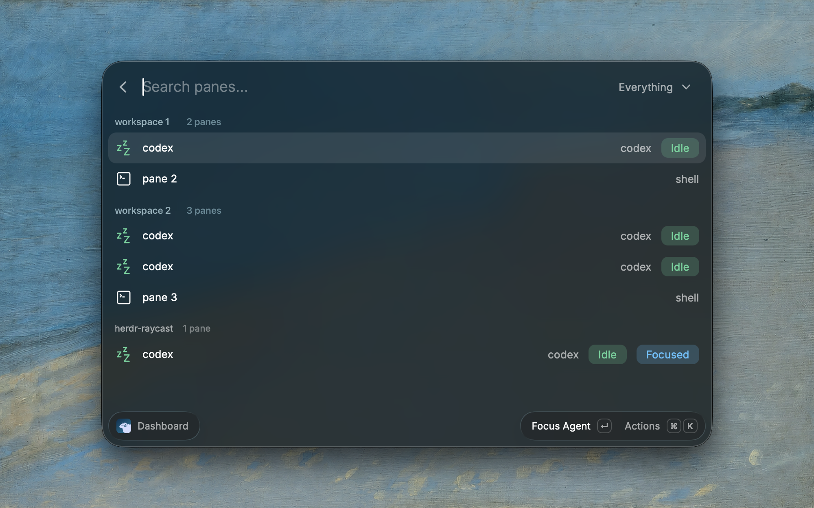

# Herdr for Raycast

> Browse and control [Herdr](https://herdr.dev) agent sessions from Raycast.



## Setup

Start Herdr in a terminal, then open **Dashboard** in Raycast. Local sessions are detected automatically.

Use **Terminal App** in preferences to override terminal detection.

## Usage

- **Dashboard:** Browse workspaces, tabs, and panes.
- **Manage Agents:** Start, prompt, and manage agents.
- **Focus Attention Agent:** See attention counts in search and jump to an agent that needs you.
- **Agent Status:** Get menu bar status and alerts when agents need you.

| Dashboard shortcut | Action                       |
| ------------------ | ---------------------------- |
| Enter              | Open a group or focus a pane |
| ⌘↵                 | Focus any item in Herdr      |
| ⌘⇧D                | Toggle details               |
| ⌘O                 | Show live output             |

Stored locally: your last 50 sent prompts, recent output, and session details.

## Development

Install Node.js 22.22.2 or newer, then run:

```sh
git clone https://github.com/terkelg/herdr-raycast.git
cd herdr-raycast
npm ci
npm run dev
```

Run `npm run lint` and `npm run build` before submitting changes.

## License

[MIT](LICENSE)
